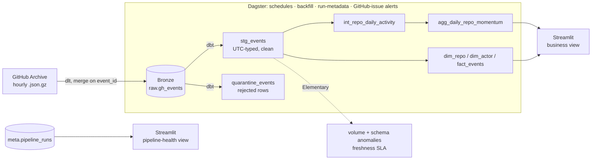

# PulseDB — Incremental, Quality-Gated Analytics for Open-Source Activity

[](https://github.com/KETAN83567/pulsedb/actions/workflows/ci.yml)


PulseDB is a local-first analytics warehouse that turns the public
[GitHub Archive](https://www.gharchive.org/) event firehose into a
**repository-momentum** data product — with the production concerns that
usually get skipped in portfolio projects: **incremental processing,
data-quality gating, observability, orchestration, and a serving layer.**

> **Stack:** dlt · DuckDB · dbt · Elementary · Dagster · Streamlit · uv · GitHub Actions
> **No Docker, no cloud bill, no SaaS** — the whole thing runs on a laptop and in CI.

---

## Why this project

Most "data engineering portfolio" projects stop at *extract → load → a chart*.
PulseDB is built to answer the questions an interviewer actually probes:

- *How do you avoid reprocessing all history every run?* → **incremental models** keyed on a `_loaded_at` watermark.
- *What happens to bad rows?* → they're **quarantined, not dropped**, and a **reconciliation invariant** (`raw == staged + quarantined`) proves nothing is lost.
- *How do you know the pipeline is healthy?* → **freshness SLAs, volume-anomaly & schema-drift detection, run-metadata logging, and failure alerting.**
- *Is the metric actually meaningful?* → the momentum score is **actor-weighted to defeat single-actor bot spam** (a real issue found in the data).

## Architecture



**Medallion layers**

| Layer | Models | Purpose |
|---|---|---|
| **Bronze** | `raw.gh_events` | Raw events, idempotently merged on `event_id` |
| **Silver** | `stg_events`, `quarantine_events`, `int_repo_daily_activity` | Typed + UTC-standardized, quality-gated, daily rollup |
| **Gold** | `dim_repo`, `dim_actor`, `fact_events`, `agg_daily_repo_momentum` | Star schema + the headline momentum metric |

## Dashboard

A two-page Streamlit app (dark-themed, fully interactive) sits on top of the
warehouse:

**Business view** — tabbed (Activity / Repositories / Contributors):
- a **linked brush timeline** — drag across the minute-level event timeline to
  recompute the event-type breakdown for that window (client-side, instant);
- normalized **composition-over-time** and an event-mix donut;
- an **actor-colored momentum leaderboard** with a min-distinct-actors filter
  that strips out single-actor bot spam;
- a **long-tail events-per-repo distribution** (log scale);
- a **searchable repository drill-down** — pick any repo to see its event
  breakdown, activity timeline, and top contributors;
- human-vs-bot contribution analytics.

**Pipeline-health view** — freshness vs. SLA, success-rate, throughput per
partition, an interactive run-duration timeline, and the full run log from
`meta.pipeline_runs`. (The operational page most portfolio dashboards omit.)

<!-- Screenshots — drop PNGs into docs/screenshots/ with these names. -->
| Business view | Pipeline health |
|---|---|
|  |  |

## Quickstart

```bash
# 0. prerequisites: uv (https://docs.astral.sh/uv/) and git
uv sync                                            # create the venv, install deps
cd transform && uv run dbt deps --profiles-dir . && cd ..

# 1. ingest one GH Archive hour into the bronze layer (idempotent)
uv run python ingestion/gh_archive_pipeline.py 2024-01-15-15
#    (set GH_MAX_EVENTS=2000 for a fast sample)

# 2. build Silver + Gold and run all tests
cd transform
uv run dbt run --select elementary --profiles-dir .   # one-time: create observability tables
uv run dbt build --profiles-dir .                     # models + tests + reconciliation
cd ..

# 3. explore
uv run streamlit run dashboard/app.py                 # dashboard  -> :8501
uv run dagster dev -m orchestration.definitions       # orchestrator -> :3000
```

Per-component docs: [`transform/`](transform/) (dbt) · [`quality/`](quality/README.md) ·
[`orchestration/`](orchestration/README.md) · [`dashboard/`](dashboard/README.md).

## Design decisions

Short rationale; full ADRs in [`docs/adr/`](docs/adr/).

- **Lightweight bronze (schematize at ingest).** Storing full event payloads
  ballooned DuckDB to ~2.2 GB/hour. Projecting to the columns that matter keeps
  it at ~29 MB/hour with no loss of analytical value. → [ADR-0002](docs/adr/0002-cost-and-storage.md)
- **Incremental event-grain, full-refresh aggregates.** `stg_events` /
  `quarantine_events` / `fact_events` are incremental (watermark on `_loaded_at`,
  dedup on `event_id`). Dimensions and aggregates rebuild from the incremental
  base — you can't naively append to a `GROUP BY`. → [ADR-0001](docs/adr/0001-incrementality.md)
- **Quarantine, don't drop.** Contract-failing rows are routed to
  `quarantine_events` and reconciled against bronze, so data loss is impossible
  to hide. → [ADR-0003](docs/adr/0003-quarantine.md)
- **Actor-weighted momentum.** Raw event volume rewards single-actor automation;
  the dashboard filters to repos with ≥2 distinct actors for a credible signal.
- **No Docker, deliberately.** DuckDB + uv make the project reproducible without
  containers — lower friction for a reviewer to run, and honest about scope.

## Data quality & observability

- Schema contracts (`not_null`/`unique`/types) on every model
- Reconciliation invariant: `raw_count == stg_count + quarantine_count`
- Grain + foreign-key tests on the star schema
- Source **freshness SLA** (warn 24h / error 48h) keyed on load time
- Elementary **volume-anomaly** + **schema-drift** detection and an HTML report
- **Run-metadata** table feeding a live pipeline-health dashboard page
- **GitHub-issue-on-failure** alerting (Dagster sensor)

## Tech choices vs. the "enterprise" version

| Concern | Enterprise | PulseDB (portfolio-credible, free) |
|---|---|---|
| Warehouse | Snowflake/BigQuery | **DuckDB** |
| Orchestrator | Airflow (Docker) | **Dagster** (no Docker) |
| Observability | Monte Carlo | **Elementary** (dbt-native) |
| Env/packaging | poetry + pyenv | **uv** |

## Repository layout

```
ingestion/      dlt pipeline (GH Archive -> bronze)
transform/      dbt project (silver/gold, tests, Elementary)
quality/        data-quality docs + Elementary report output
orchestration/  Dagster assets, schedules, run-metadata, alerting
dashboard/      Streamlit business + pipeline-health pages
docs/adr/       architecture decision records
sample_data/    tiny committed slice for inspection
```
